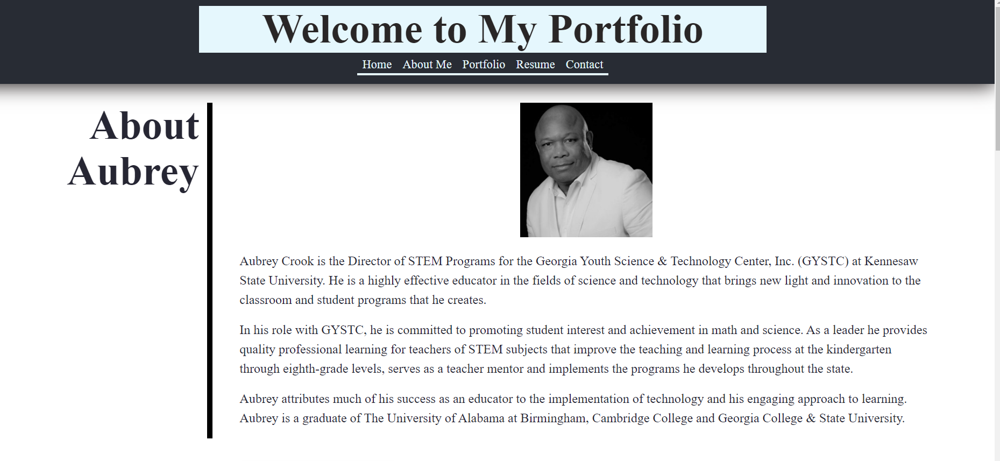

# Aubrey Crook's  React Portfolio 

## Description

This website contains my portfolio which consists of my resume, work samples and contact information.   

## Table of Contents

- [Description](#description)
- [Installation](#installation-instructions)
- [Usage](#usage-information)
- [License](#license-information)
- [Contribution](#contribution-guidelines)
- [Test Instructions](#test-instructions)
- [Questions](#questions)

## Installation Instructions

Visit https://14kappaman.github.io/AC-React-Portfolio/

## Usage Information

This project was used to create a React version of my Web Development portfolio. 

## License Information

none

## Contribution Guidelines

Contributions are not accepted.

## Test Instructions

No test functionality provided for this project.

## Questions 

Please contact the email below with questions

github username: 14Kappaman

email: aubrey.crook@gmail.com